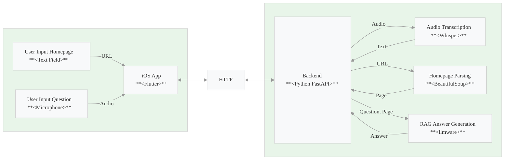

# Who? What? Where?
Speech Driven Website Query Assistant for iOS.


---

## 🛠 App Architecture and Libraries
### App Architecture


The diagram illustrates the flow of data between the **www Flutter iOS App** and the **Python Backend**.

#### iOS Application
The iOS App uses the Flutter development toolkit.
1. **User Input Homepage**:  
   - The user enters a **homepage URL** into a text field.  
   - This input is sent via HTTP to the backend.  

2. **User Input Question**:  
   - The user records a **question** using the device's microphone.
   - The `audio_waveforms` package is used to display a wave form and write the microphone input to a file.
   - The audio file is sent via HTTP to the backend.

3. **Display**:
   - The status of the various steps is displayed.
   - The **transcribed text** of the question is displayed in a text field.
   - The **final answer** is displayed to the user. 
---

#### HTTP Protocol  
- The HTTP Protocol serves as the central layer for communication between the Flutter application and the Python backend.
---

#### Python Backend
1. **Audio Transcription**:  
     - The audio question is transcribed to text using **Whisper**.  
2. **Homepage Parsing**:  
     - The homepage URL content is parsed using a webdriver and **BeautifulSoup**.  
3. **RAG Answer Generation**:  
     - The transcribed question and the parsed homepage content are combined using the **llmware** Python package.

---

### Libraries

1. **Whisper**
Whisper is a general-purpose speech recognition model. It is trained on a large dataset of diverse audio. Here we use it to transcribe audio to text. For this app the `small` model is used, which is a fast *English only* model which runs smoothly on a Mac with M2.
2. **Beautifulsoup and selenium**:
For homepage parsing I use a *selenium webdriver* which allows to render also dynamic pages into html content. This html content is then parsed using *beautifulsoup (bs4)*. There is also a simpler version implemented using *html2text*. However, this fails for dynamic pages (e.g. using js).
3. **llmware**:
For Retrieval Augmented Generation (RAG) I use **llmware** which is a framework that comes with a very lean Python interface which allows to easily query context. It basically does all the heavy lifting that otherwise would have been needed (split text into chunks &rarr; tokenize &rarr; generate embeddings &rarr; index &rarr; retrieval &rarr; generate tokens with language model &rarr; decode).

## 🚀 Installation
### Python Backend
For detailed installation instructions see the [Python Backend README](python/backend/README.md).

### Flutter App
For detailed installation instructions see the [Flutter App README](flutter/README.md).

## Running the server and iOS application with Simulator
First, start the Python backend:
```
cd python/backend
poetry run server
```

Next, start the App:
Open a simulator, e.g. iPhone 15 with iOS 17.5.
```
cd flutter
flutter run
```

Select the simulator you just started.

## Open Issues
As always, things are never really done. For open issues and improvements see:
https://github.com/nischnei/werwiewas/issues

